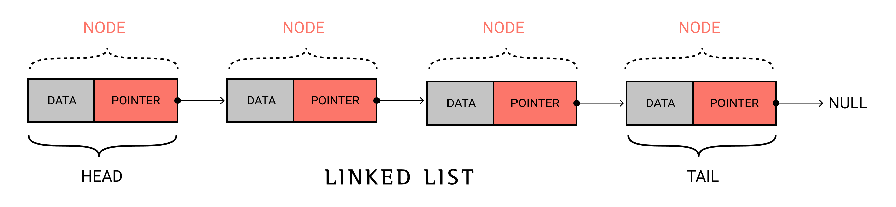

# LINKED LIST

A linked list is a `linear data structure` which can store data in random location. 
Every data is paired with an address which points to next consecutive data. The pair of data and pointer is known as `Node`.
 
Each node consists of two parts:  
1. Data
2. Pointer

Data part stores the data whereas Pointer stores the address of next node. The random placing of nodes in memory is made possible by pointer variable.

## Terms related to list
* node
> A pair containing data and pointer variable. It is the building block of linked list.

* head
> A pointer that points the begining node of a linked list.

* tail
> A pointer that points  to `NULL`, indicating the end node of linked list. 

## TYPES OF LINKED LIST
1. Singly linked list
2. Doubly linked list
3. Circular linked list
4. Doubly circular linked list

