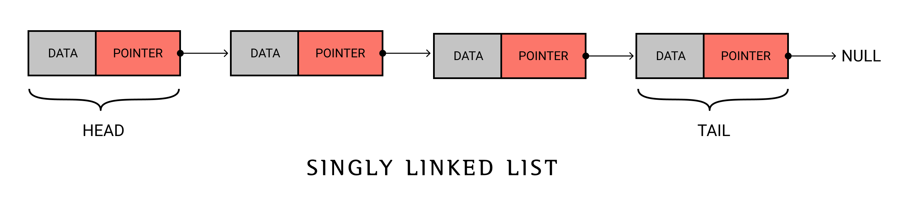
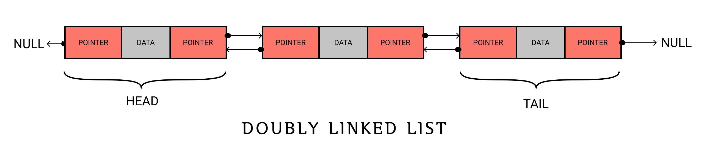
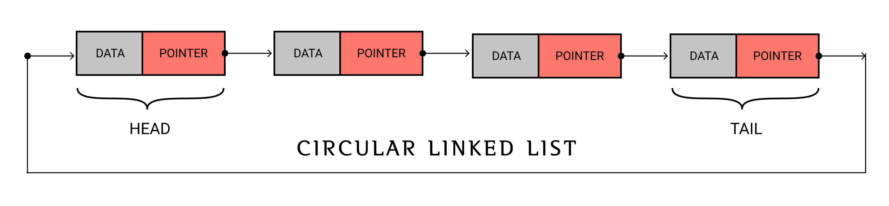
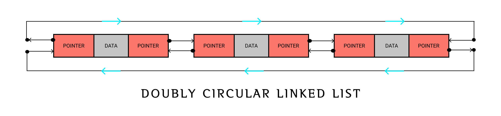

# LINKED LIST

A linked list is a `linear data structure` which can store data in random location. 
Every data is paired with an address which points to next consecutive data. The pair of data and pointer is known as `Node`.
 
Each node consists of two parts:  
1. Data
2. Pointer

Data part stores the data whereas Pointer stores the address of next node. The random placing of nodes in memory is made possible by pointer variable.

## Terms related to list
* node
> A pair containing data and pointer variable. It is the building block of linked list.

* head
> A pointer that points the begining node of a linked list.

* tail
> A pointer that points  to `NULL`, indicating the end node of linked list. 

<!-- advantages -->
## ADVANTAGES OF USING LINKED LIST OVER ARRAY
* `SIZE` &nbsp; Linked list can grow and shrink during runtime unlike arrays which has fixed size.
* `MEMORY ALLOCATION` &nbsp; Static array is allocated with memory during compilation whereas linked list and even dynamic array are provided memory location during runtime.
* `MEMORY EFFICIENCY` &nbsp; For same number of data members Array use less memory location where as linked list take more memory as each data members should store pointers.
* `EXECUTION TIME` &nbsp; As arrays are stored in contigious memory elements in array can be accessed faster than nodes in linked list. However insertion, deletion in linked list is faster and easier than that of array.

## TYPES OF LINKED LIST
## 1. Singly linked list 
 > In singly linked list each node is associated with only one pointer variable except `HEAD NODE` AND `TAIL NODE`. 
 > It is also known as `LINEAR LINKED LIST`. 
 > `PROS` : Takes less memory location than doubly linked list due to the use of less no of pointers. 
 > `CONS` : Unable to access predecessor node from current node.

## 2. Doubly linked list 
  In doubly linked list each node is associated with two nodes (previous and next node) except for  `HEAD NODE` AND `TAIL NODE`

## 3. Circular linked list 

## 4. Doubly circular linked list 

