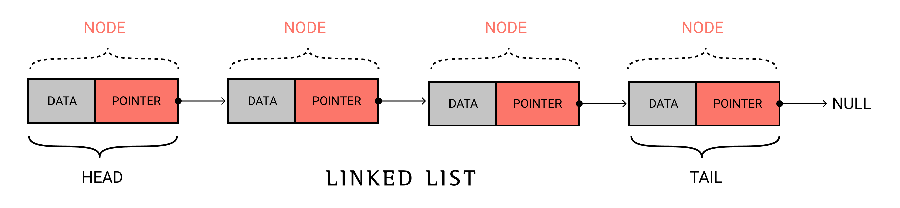

# DSA

# ABSTRACT DATA TYPES
In computer science, an abstract data type (ADT) is a mathematical model for data types. An abstract data type is defined by its behavior (semantics) from the point of view of a user, of the data, specifically in terms of possible values, possible operations on data of this type, and the behavior of these operations

Abstract Data Types are focused on what, not how (they're framed declaratively, and do not specify algorithms or data structures). Common examples include 
1. List
2. Stack
3. Set
4. Queue

## LINKED LIST

Linked list is dynamically implemented data structure which gets stored in random memory locations unlike arrays which seeks contigious memory location.  

